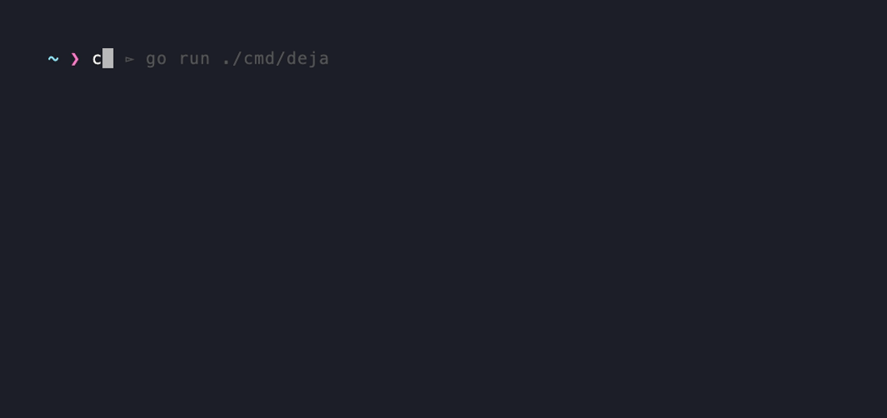

<div align="center">
  
  <h1>deja</h1>
  <p><strong>Predictive ghost-text autosuggestions for zsh — smarter than history, lighter than a plugin.</strong></p>

  <p>
    <a href="https://github.com/Giammarco-Ferranti/deja/releases"></a>
    <a href="LICENSE"></a>
    <a href="https://goreportcard.com/report/github.com/Giammarco-Ferranti/deja"></a>
  </p>
</div>

---

Deja is a smarter replacement for [`zsh-autosuggestions`](https://github.com/zsh-users/zsh-autosuggestions). Instead of only surfacing commands that start with what you've typed, Deja uses **fuzzy matching**, **directory awareness**, and **command sequence prediction** to suggest what you actually want to run — as inline ghost text, after every keystroke, with zero latency.

No account. No sync server. No TUI. Just ghost text that knows where you are.

<div align="center">
  
</div>

---

## Features

- **Fuzzy matching** — suggests commands even when you skip letters or mix up order
- **Directory awareness** — commands you run in `~/projects/foo` rank higher when you're in `~/projects/foo`
- **Sequence prediction** — knows that you usually run `make test` after `make build`
- **Frecency scoring** — blends frequency + recency with a 1-week exponential decay
- **Ghost text inline** — uses zsh's `POSTDISPLAY` widget, not a separate pane
- **Daemon architecture** — one lightweight background process serves all terminal windows; `<1ms` response per keystroke
- **Local-only** — all data stays in a local SQLite database; nothing leaves your machine
- **Alternatives picker** — press `Tab` to cycle through ranked alternatives without leaving the line

---

## Installation

### Homebrew (macOS & Linux)

```bash
brew install Giammarco-Ferranti/deja/deja && deja import && (grep -qF 'deja init zsh' ~/.zshrc 2>/dev/null || echo 'eval "$(deja init zsh)"' >> ~/.zshrc) && exec zsh
```

### curl (any Linux/macOS, no Homebrew required)

```bash
curl -fsSL https://raw.githubusercontent.com/Giammarco-Ferranti/deja/main/install.sh | sh
```

Both commands install deja, import your existing zsh history, add the integration to `~/.zshrc` (idempotent), and reload your shell. To audit the curl installer before running it, [view it on GitHub](https://github.com/Giammarco-Ferranti/deja/blob/main/install.sh).

---

## Setup

The install commands above already do this for you. If you skipped them and have the binary on `$PATH` some other way, run these once to import your zsh history and activate the integration:

```bash
deja import
eval "$(deja init zsh)"
```

To make it permanent, add the `eval` line to your `~/.zshrc`:

```zsh
# ~/.zshrc
eval "$(deja init zsh)"
```

Deja auto-spawns its daemon on first use and keeps it running across sessions.

---

## Key Bindings

| Key | Action |
|---|---|
| `→` (right arrow) | Accept full suggestion |
| `Ctrl+→` | Accept next word only |
| `Tab` | Open inline alternatives picker |
| `Ctrl+X` | Suppress current suggestion |

---

## Troubleshooting

Every subcommand supports `--help` (e.g. `deja query --help`) for flag-level details. The most common issues:

**Suggestions aren't appearing.**
1. Check the daemon is reachable: `deja ping` should print `pong`.
2. Confirm the integration is loaded in your shell: `eval "$(deja init zsh)"` must be in `~/.zshrc` and the shell re-sourced (`exec zsh`).
3. `Ctrl+X` toggles per-session suppression — start a new shell to clear it.

**The daemon seems stuck.**
```bash
pkill -f 'deja daemon'
```
A fresh terminal will auto-respawn it via the init script.

**Stale socket after a crash.**
```bash
rm ~/.local/share/deja/sock
```
Then open a new shell.

**Reset the database (start over from current `~/.zsh_history`).**
```bash
pkill -f 'deja daemon'
rm ~/.local/share/deja/deja.db
deja import
```

**Where data lives.**

| Path | Purpose |
|---|---|
| `~/.local/share/deja/deja.db` | SQLite database (history, stats, sequences) |
| `~/.local/share/deja/sock` | Unix socket the daemon listens on |
| `~/.local/share/deja/init.zsh` | Generated zsh integration script |

---

## How It Works

Deja is built around four signals that are combined into a single composite score:

```
score = 1.0 × fuzzy
      + 0.4 × frecency
      + 0.3 × directory_affinity
      + 0.5 × sequence_score
```

| Signal | What it measures |
|---|---|
| **Fuzzy** | Subsequence match quality with bonuses for consecutive characters, word boundaries, and prefix hits |
| **Frecency** | Log-scaled frequency combined with exponential recency decay (1-week half-life) |
| **Directory affinity** | How often you've run this command from the current directory |
| **Sequence score** | Probability that this command follows the one you just ran |

### Architecture

```
┌─────────────────┐     JSON/Unix socket      ┌──────────────────────┐
│   zsh widget    │ ──────────────────────▶   │   deja daemon        │
│  (per keystroke)│ ◀──────────────────────   │  (single process,    │
└─────────────────┘    suggestion (<1ms)       │   all terminals)     │
                                               └──────────┬───────────┘
                                                          │
                                                    SQLite (WAL)
                                               commands · stats · seqs
```

The daemon loads all state into memory at startup (`map[string]*CommandStat`, top-100 directory affinities, sequence pairs) and uses a `sync.RWMutex` so reads never block each other. Writes (command recording) take microseconds.

If the daemon is unavailable, `deja query` falls back to a direct SQLite read automatically.

---

## Building from Source

```bash
git clone https://github.com/Giammarco-Ferranti/deja.git
cd deja
make build        # produces ./bin/deja

go test ./...     # run all tests
go vet ./...      # lint
```

### Releases

Releases are automated via [release-please](https://github.com/googleapis/release-please) and driven by [conventional commits](https://www.conventionalcommits.org/) on `main`:

- `feat: ...` → minor bump
- `fix: ...` → patch bump
- `feat!: ...` or a `BREAKING CHANGE:` footer → major bump
- `chore:`, `docs:`, `test:`, `refactor:` → no version bump

After qualifying commits land on `main`, the `release-please` workflow opens (and keeps updating) a **Release PR** that bumps `.release-please-manifest.json` and updates `CHANGELOG.md`. **Merging that PR is the release action** — it creates the `vX.Y.Z` git tag, which triggers `release.yml` to run the test suite and (only on green) publish binaries via GoReleaser and update the [Homebrew tap](https://github.com/Giammarco-Ferranti/homebrew-deja).

Maintainers should not run `git tag` manually.

---

## Contributing

Contributions are welcome — see [CONTRIBUTING.md](CONTRIBUTING.md) for setup, workflow, and commit conventions. For anything larger than a small fix, please open an issue first so we can align on direction.

The scorer (`internal/scorer/`) is the most iteration-heavy part of the codebase — the four signal weights are the best place to experiment if you want to improve suggestion quality.

## Security

Please report vulnerabilities privately via GitHub's "Report a vulnerability" button on the repo's Security tab, not as public issues.

---

## Uninstall

1. Remove the integration line from `~/.zshrc`:
   ```zsh
   eval "$(deja init zsh)"
   ```
2. Stop the running daemon:
   ```bash
   pkill -f 'deja daemon'
   ```
3. Delete local data (history DB, socket, generated init script):
   ```bash
   rm -rf ~/.local/share/deja/
   ```
4. Remove the binary, depending on how you installed it:
   - **Homebrew:** `brew uninstall deja` (and optionally `brew untap Giammarco-Ferranti/deja`)
   - **curl installer:** `rm "$(which deja)"` (default location is `~/.local/bin/deja`)

---

## License

MIT — see [LICENSE](LICENSE).

---

<div align="center">
  <sub>Made with ☕ and a friendly ghost.</sub>
</div>
