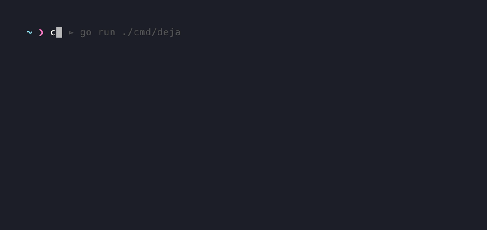

<div align="center">
  <p></p>
  <h1>deja</h1>
  <p>Predictive inline suggestions for zsh.</p>

  <p>
    <a href="https://github.com/Giammarco-Ferranti/deja/releases"></a>
    <a href="https://github.com/Giammarco-Ferranti/deja/actions/workflows/test.yml"></a>
    <a href="LICENSE"></a>
  </p>
</div>

Deja is a smarter replacement for
[zsh-autosuggestions](https://github.com/zsh-users/zsh-autosuggestions).
It learns which commands you run together and predicts what comes next, such
as `make test` after `make build`. It also uses fuzzy matching and your current
directory to find and rank commands from your history. Suggestions appear as
inline ghost text in your prompt.

[Installation](#installation) · [Usage](#usage) ·
[Configuration](#configuration) · [Troubleshooting](#troubleshooting) ·
[Security](#security)

<div align="center">
  
  <p><sub>Type a command, inspect the suggestion, and accept it from your prompt.</sub></p>
</div>

## Features

- Sequence prediction: Learns command sequences, such as running `make test`
  after `make build`.
- Fuzzy matching: Type `gco` to find `git checkout`. Skip letters while
  preserving their order.
- Directory awareness: Commands you run in a project directory rank higher
  when you return there.
- Frecency scoring: Ranks commands using how often and how recently you ran them.
- Inline suggestions: Shows ghost text directly in your zsh prompt.
- Shared daemon: One background process serves all your terminal windows.
- Local storage: Keeps your command history in a local SQLite database without
  sending it to a server.
- History exclusions: Skips live commands excluded by `HIST_IGNORE_SPACE` or
  `HISTORY_IGNORE`.
- Alternatives picker: Press `Tab` to cycle through ranked suggestions.

deja replaces [zsh-autosuggestions](https://github.com/zsh-users/zsh-autosuggestions).
Remove that plugin before enabling deja. See
[plugin conflicts](docs/troubleshooting.md#plugin-conflicts) if deja reports
that another suggestion plugin is active.

## Installation

deja supports zsh on macOS and Linux, including WSL on Windows, with release
binaries for Intel/AMD (`amd64`) and ARM (`arm64`).

### Homebrew

Install from Homebrew core:

```sh
brew install deja
```

Follow [shell setup](#shell-setup) below, or use this one-liner to install deja,
import your history, configure `~/.zshrc`, and restart zsh:

```sh
brew install deja && deja import && (grep -qF 'deja/init.zsh' ~/.zshrc 2>/dev/null || echo 'if [[ -r "$HOME/.local/share/deja/init.zsh" ]]; then source "$HOME/.local/share/deja/init.zsh"; else eval "$(deja init zsh)"; fi' >> ~/.zshrc) && exec zsh
```

### curl

On macOS or Linux, including WSL on Windows:

```sh
curl -fsSL https://raw.githubusercontent.com/Giammarco-Ferranti/deja/main/install.sh | sh
```

The installer imports history and adds the integration when it detects zsh.
Restart your shell with `exec zsh` after it finishes.
[Read the installer](https://github.com/Giammarco-Ferranti/deja/blob/main/install.sh)
or see [installer options](docs/installation.md#curl-installer).

### Shell setup

Follow these steps if your installation method has not configured your shell.

1. Import your existing zsh history:

   ```sh
   deja import
   ```

   The importer reads an exported `$HISTFILE`, or `~/.zsh_history` otherwise.
   For a different location, use `deja import --file /path/to/history`.

2. Add this integration to `~/.zshrc`:

   ```zsh
   if [[ -r "$HOME/.local/share/deja/init.zsh" ]]; then
     source "$HOME/.local/share/deja/init.zsh"
   else
     eval "$(deja init zsh)"
   fi
   ```

   If you use `$ZDOTDIR`, edit the `.zshrc` in that directory instead.
   If a deja plugin already loads the integration, skip this step.

3. Restart your shell:

   ```sh
   exec zsh
   ```

The integration starts the daemon for you. Later shells source the cached
script, which deja refreshes in the background when the binary changes.

### Other installation methods

- [Oh My Zsh](docs/installation.md#oh-my-zsh)
- [zinit](docs/installation.md#zinit)
- [Manual plugin installation](docs/installation.md#manual-plugin-installation)
- [Build from source](docs/installation.md#build-from-source)

Choose one method to load the integration. The
[installation guide](docs/installation.md) also covers updating and uninstalling.

## Usage

Start typing a command you have run before. For example, after running
`git checkout main`, typing `gco` can suggest it again. deja suggests commands
from your history; it does not generate new commands.

Press `Right` to copy the full suggestion into your command line, then press
`Enter` to run it. `Enter` alone runs only the text already in your buffer.

### Keyboard shortcuts

| Key | Action |
| --- | --- |
| `Right` | Accept the full suggestion |
| `Ctrl+Right` | Accept the next word |
| `Tab` | Open the alternatives picker and cycle through suggestions |
| `Ctrl+X` | Toggle suggestions for this shell session |
| `Shift+Right` | Cycle fuzzy presets forward: tight, smart, loose |
| `Shift+Left` | Cycle fuzzy presets backward: loose, smart, tight |
| `Shift+Up` | Toggle suggestions on an empty prompt |

Fuzzy presets and empty-prompt settings persist and affect the shared daemon.
`Ctrl+X` affects only the current shell. Terminal key sequences can differ;
see [custom key bindings](docs/configuration.md#key-bindings) to remap them.

### Fuzzy matching

The default `smart` preset allows gaps between matched letters. Use `tight`
for smaller gaps or `loose` for larger ones:

```sh
deja fuzzy           # show the current preset and examples
deja fuzzy tight     # change the preset
deja fuzzy cycle     # select the next preset
deja fuzzy back      # select the previous preset
```

When your input starts a command in your history, deja keeps suggestions
within that command. Read about
[matching and anchoring](docs/architecture.md#matching-and-anchoring).

### Empty prompts

deja also suggests a command before you start typing. To show suggestions only
after you type, turn empty-prompt suggestions off:

```sh
deja empty off
```

Use `deja empty on` to restore them, `deja empty toggle` to switch the setting,
or `deja empty` to check its current value.

## Configuration

Put shell settings above the lines that load deja in your `.zshrc`.
For example, change the ghost text colour:

```zsh
export DEJA_HIGHLIGHT_STYLE='fg=cyan'
```

The [configuration guide](docs/configuration.md) covers key bindings, colours,
fuzzy presets, and empty-prompt settings, including their scope and defaults.

## Troubleshooting

If suggestions do not appear, run `deja ping`; a reachable daemon prints `pong`.
Check that your `.zshrc` loads the integration and that `Ctrl+X` has not
suppressed suggestions in the current shell.

After upgrading, replace the daemon from the previous version:

```sh
deja daemon --restart
```

This runs in the foreground. For a daemon started by the integration, follow
[daemon recovery](docs/troubleshooting.md#daemon-recovery).

See the [troubleshooting guide](docs/troubleshooting.md) for plugin conflicts,
faint ghost text, stale sockets, and database resets. Each subcommand also
supports `--help`, for example `deja query --help`.

## Privacy

deja stores command history in plaintext under `~/.local/share/deja/`.
It restricts the data directory to `0700` and database files to `0600`.
It does not encrypt history or automatically redact secrets in commands.

Enable `setopt hist_ignore_space` and prefix a sensitive command with a space
to keep deja's recording hook from forwarding it. See the
[privacy guide](docs/privacy.md) for history exclusions and existing data.

## Security

[Report a vulnerability privately](https://github.com/Giammarco-Ferranti/deja/security/advisories/new).
Read [SECURITY.md](SECURITY.md) for the reporting process and supported version
policy. Keep vulnerability details out of public issues.

## Contributing

See [CONTRIBUTING.md](CONTRIBUTING.md) for development setup, checks, and release
procedures. Open an issue before starting a larger change.

The [architecture guide](docs/architecture.md) describes the shell integration,
daemon, storage, and ranking algorithm. Release history is in
[CHANGELOG.md](https://github.com/Giammarco-Ferranti/deja/blob/main/CHANGELOG.md).

## License

[MIT](LICENSE).
