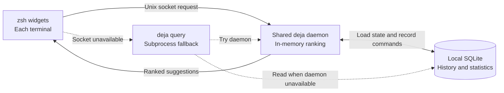

# How deja works

[Back to the README](../README.md)

[Shell and daemon](#shell-and-daemon) · [Ranking](#ranking) ·
[Matching and anchoring](#matching-and-anchoring) · [Fallback](#fallback)

## Shell and daemon



The shell integration wraps ZLE widgets and displays suggestions through
`POSTDISPLAY` and `region_highlight`. By default, it fetches suggestions
asynchronously with `zle -F`, then updates the ghost text when a response arrives.

When zsh's `zsh/net/socket` module is available, the integration sends requests
directly over a Unix socket. Otherwise, it launches `deja query` as a subprocess.
The daemon supports a text protocol for the shell and JSON for the CLI client.

One daemon serves the user's terminal windows. At startup it loads command
statistics and directory counts into memory. It loads and caches sequence
counts as requests need them. A `sync.RWMutex` coordinates concurrent
suggestions and recording updates.

The shell's `preexec` and `precmd` hooks track commands and send execution
metadata to the daemon. SQLite uses write-ahead logging and stores raw commands,
aggregated command statistics, and consecutive command pairs.
See [privacy](privacy.md) for exclusions and file permissions.

`deja init zsh` writes `~/.local/share/deja/init.zsh` and prints a `source`
line. The recommended activation block sources the cached file on later shell
starts. The integration compares the installed binary's size, modification
time, and inode with the values recorded in the script. If they differ, it
regenerates the script in the background; a later shell loads that update.

## Ranking

The scorer combines four signals:

```text
score = 1.0 * fuzzy
      + 0.4 * frecency
      + 0.3 * directory_affinity
      + 0.5 * sequence_score
```

| Signal | Measurement |
| --- | --- |
| Fuzzy | Subsequence match quality, including consecutive letters, word boundaries, and prefixes |
| Frecency | Log-scaled frequency and exponential recency decay with a seven-day half-life |
| Directory affinity | The share of a command's recorded uses in the current directory |
| Sequence score | How often a command followed the previous command, relative to its most frequent successor |

The daemon returns the highest-ranked command and up to four alternatives.
The shell's inline picker cycles through these candidates.

## Matching and anchoring

Fuzzy matching preserves character order. `gco` can match `git checkout`,
subject to the gap limit selected by the [fuzzy preset](configuration.md#fuzzy-matching).

The scorer restricts candidates before matching:

1. If any history command starts with the complete input, consider only those
   prefix matches. Typing `cd ` keeps suggestions within recorded `cd` commands.
2. Otherwise, if the input's first word is a command name in the history,
   consider candidates with that command name. Typing `git ceckout` can still
   find `git checkout main`.
3. Otherwise, search across the history. This permits abbreviations such as
   `gco` for `git checkout`.

If an anchored input has no match, the shell shows no suggestion. The matcher
does not invent a command or substitute a command with a different name.

## Fallback

If the daemon is unavailable, `deja query` reads SQLite and ranks candidates
directly. It first computes the fuzzy, frecency, and sequence signals, then
fetches directory counts for a bounded shortlist that could enter the visible
results. It adds directory affinity to the existing scores and sorts again.

An older daemon that lacks the shell's text protocol also causes the
integration to use the CLI subprocess path. See
[daemon recovery](troubleshooting.md#daemon-recovery) to replace it.
